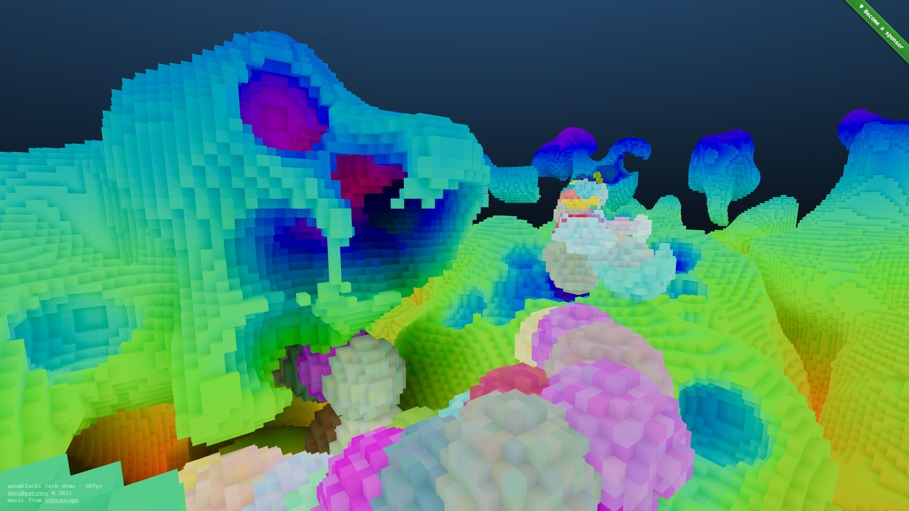

[wasmblocks tech demo](https://wasmblocks.gatunes.com/)
==

[](https://wasmblocks.gatunes.com/)

> A tech demo of yet another voxelizer. This time with a backend implemented in C.

#### Live deployment

[https://wasmblocks.gatunes.com/](https://wasmblocks.gatunes.com/)

#### Dev dependencies

To build this, you'll need to install LLVM:
[https://chocolatey.org/packages/llvm](https://chocolatey.org/packages/llvm)

It will complain about a missing file that you can get here:
[libclang_rt.builtins-wasm32-wasi-12.0.tar.gz](https://github.com/WebAssembly/wasi-sdk/releases/download/wasi-sdk-12/libclang_rt.builtins-wasm32-wasi-12.0.tar.gz)

Just put it on the same path that the error specifies and you should be good to go.

#### Local development

```bash
# clone this repo and it's submodules
git clone --recursive https://github.com/danielesteban/wasmblocks.git
cd wasmblocks
# build wasi-lib
cd vendor/wasi-libc/ && make -j8 && cd ../..
# install dev dependencies
npm install
# start the dev environment:
npm start
# open http://localhost:8080/ in your browser
```
